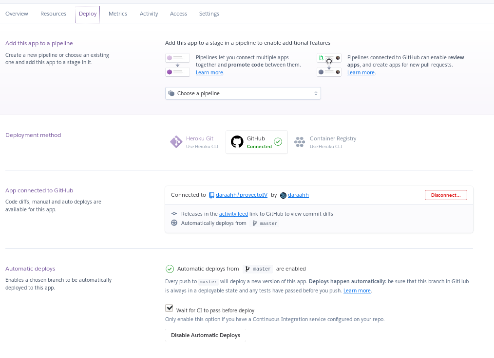

[](https://travis-ci.com/daraahh/proyectoIV)
[](https://circleci.com/gh/daraahh/proyectoIV)

## Lista de contenidos
- [Descripción general](#descripción-general)
- [Motivacion](#motivación)
- [Implementación](#implementación)
- [Herramientas de construcción, prueba, arranque y parada](#herramientas-de-construcción-prueba-arranque-y-parada)
- [Integración continua](#integración-continua)
- [API-REST](#api-rest)
- [Despliegue PaaS](#despliegue-paas)
- [DockerHub](#dockerhub)
- [Despliegue contenedor](#despliegue-contenedor)
- [Creación y Aprovisionamiento de MV](#creación-y-aprovisionamiento-de-mv)

_________

## Descripción general

Microservicio para gestionar la información relativa a los horarios de las asignaturas del Grado en Ingeniería Informática.


## Motivación

Principalmente, permitir a una posible futura aplicación acceder a la información relativa a las asignaturas de forma sencilla con el fin de poder crear horarios con facilidad para, por ejemplo, **detectar conflictos** entre dos asignaturas.

Adicionalmente, podría permitir **exportar** el horario creado por un usuario a un archivo PDF o como una imagen en formato JPEG, PNG...  

## Implementación

Se usará el lenguaje ***Ruby*** para desarrollar el microservicio, principalmente para reforzar lo aprendido en asignaturas previas.
- Framework para desarrollo web: [Sinatra](http://sinatrarb.com/). Ya que el microservicio a desarrollar es bastante simple con este framework será suficiente y no será necesario usar frameworks algo más robustos como Padrino o Ruby on Rails. Además la documentación sobre este framework me ha parecido exepcional.
- Entorno virtual de desarrollo: [rbenv](https://github.com/rbenv/rbenv). Porque permite manejar distintas versiones de Ruby de forma sencilla.

Como base de datos se usará [CouchDB](http://couchdb.apache.org/), principalmente para indagar un poco sobre bases de datos NoSQL y porque usa JSON para almacenar los datos, algo que creo se va a ajustar a lo que quiero hacer.

Como sistema de log se usará [Logstash](https://www.elastic.co/products/logstash).
- Haciendo uso de [LogStashLogger](https://github.com/dwbutler/logstash-logger), que extiende la clase `Logger` de Ruby para dar soporte a Logstash.

## Herramientas de construcción, prueba, arranque y parada

### Prerrequisitos

El proyecto es desarrollado en la versión 2.6.4 de Ruby. Para evitar posibles problemas podemos establecer la versión de Ruby del proyecto de forma local haciendo uso de **rbenv**:

`rbenv local 2.6.4`

Aunque para instalar las dependencias no será necesario ya que la versión del lenguaje está indicada en el archivo `Gemfile`, como se ve en el siguiente apartado.

### Instalación de dependencias

Necesitamos instalar las gemas de las que depende el proyecto para garantizar su correcto funcionamiento. Para ello, usamos la herramienta de construcción `rake`, desde la que se ejecutará **bundle**:

`rake install`

```ruby
desc "Instalar las dependencias necesarias"
task :install do
	exec "bundle install"
end
```

Esto instalará de forma automática las gemas indicadas en el fichero [Gemfile](https://github.com/daraahh/proyectoIV/blob/master/Gemfile) en el directorio raíz del repositorio.

### Prueba

Para automatizar la ejecución de tests hago uso de `rake`. Esta herrramienta de automatización está escrita en Ruby y el archivo `Rakefile`, que contiene las tareas a ejecutar, sigue la sintaxis de Ruby.

La gran ventaja que encuentro en el uso de `rake` y `Rakefile` es que al tratarse Ruby de un lenguaje de alto nivel, nos permite abstraer de forma más cómoda las tareas a realizar y definir patrones fácilmente para identificar y ejecutar las diferentes tareas que definamos.

Para ejecutar los tests, nos situamos en el directorio raíz del repositorio y ejecutamos:

`rake test`

Si quisieramos ejecutar sólo los tests unitarios o sólo los tests funcionales, podemos usar comandos independientes:

`rake unit_tests`

`rake functional_tests`

### Arranque y parada del servicio

Para llevar a cabo estas tareas hago uso de `Rack`, que nos permite levantar el servicio de forma sencilla con la configuración indicada en el fichero [config.ru](https://github.com/daraahh/proyectoIV/blob/master/config.ru). De esta forma, solo tendremos que usar `rackup` para levantar un servidor [thin](https://github.com/macournoyer/thin) (aunque *rackup* permite otros servidores he elegido este porque es simple y ligero) y poner en funcionamiento el servicio.

He definido dos tareas nuevas en el archivo [Rakefile](https://github.com/daraahh/proyectoIV/blob/master/Rakefile) para arrancar y parar el servicio de forma sencilla. Actualmente, hago uso del gestor de procesos `pm2` que me permitirá gestionar y guardar los PID de los procesos que se arrancan.

Tras probar numerosos gestores de procesos para Ruby, como `Invoker`, `Procman`, `Procodile`, `Foreman`... He decidido usar `pm2` porque *funciona* y se ajusta de una forma más cómoda a lo que buscaba. Además, la última versión estable es relativamente reciente y no de hace 5 años, a parte de que funciona con la versión de Ruby en la que estoy desarrollando el proyecto.

```ruby
desc "Arranca la aplicación"
task :start do
  exec "pm2 start sinatra_app.json"
end

desc "Para la aplicación"
task :stop do
  exec "pm2 stop sinatra-app-IV"
end
```
Fichero sinatra_app.json:

```json
{
	"apps": [
		{
			"name": "sinatra-app-IV",
			"env": {
				"PORT": 8080
			},
			"script": "rackup -s thin -p $PORT config.ru",
			"exec_mode": "fork_mode"
		}
		]
}
```


Para arrancar la aplicación, ejecuta `rackup`, indica el servidor de tipo `thin` e indica el puerto de escucha mediante una variable de entorno `PORT`, seguido del fichero de configuración que indica la aplicación a ejecutar.

Para para la aplicación, indicamos a `pm2` que pare el proceso identificándolo mediante el nombre que proporcionamos al arrancarlo `sinatra-app-IV`.

El uso es sencillo y es el siguiente:

Arranca el servicio de forma local, ejecución en segundo plano y escuchando en el puerto 9292:

`rake start`

Para detener el servicio:

`rake stop`

##### ¿Qué se testea actualmente?
- Clase SchedManager, gestora de las operaciones de recuperación, adición y eliminación de información que se realizan sobre el fondo de datos, actualmente un archivo json con datos de prueba. [Tests unitarios](https://github.com/daraahh/proyectoIV/blob/master/t/unit_test.rb)
	- Que se recupere un elemento localizable por un identificador.
	- Que se añada un elemento de forma adecuada al conjunto de datos.
	- Que se elimine un elemento de forma adecuada del conjunto de datos.

- Clase App, aplicación Sinatra, una API REST que recoge las funcionalidades del servicio y atiende las peticiones. [Tests funcionales](https://github.com/daraahh/proyectoIV/blob/master/t/functional_test.rb)
	- Que se devuelve un estado correcto como respuesta, ya sea de tipo 200 o 400.
	- Que la respuesta es de tipo JSON.
	- Que los datos recuperados son los adecuados.
	- Que se añade una asignatura de forma adecuada.
	- Que se elimina una asignatura de forma correcta.

## Integración continua

Como sistemas de integración continua he decidido usar TravisCI y CircleCI.

### TravisCI

TravisCI permite una configuración rápida y sencilla para la automatización de tests cuando se hace un push al repositorio.

El archivo de configuración en uso es el mostrado abajo. Se especifica el lenguaje en uso y la versión del mismo, en mi caso 2.6.4.

Por defecto, en el caso de Ruby, Travis ejecutará los comandos `bundle install` para instalar las dependencias y `rake test` para lanzar los tests unitarios:

```yml
language: ruby
rvm:
    - 2.6.4
install: bundle install
script: rake test
```

### CircleCI

La configuración de Circle no es tan inmediata pero es bastante intuitiva y de fácil lectura debido a que sigue un formato `YAML`.

Una de las ventajas que le encuentro frente a Travis es que Circle tiene un sistema de cache para los requerimientos de instalación por lo que las builds son más rápidas.

Incluyo node en la imagen predefinida ya que necesito instalar `npm` para posteriormente instalar `pm2`. El autoinstalador en la documentación de `pm2` que descarga pm2 sin que sea necesario `npm`, no me ha funcionado en la build de CircleCI y por ello he tenido que optar por instalar todo, aunque el 85% no lo necesito.

```yaml
version: 2
jobs:
  build:
    docker:
    #Definimos el lenguaje y la versión. El OS por defecto es Ubuntu.
      - image: circleci/ruby:2.6.4-node
    # Lista de los pasos que se van a llevar a cabo en el job
    steps:
      - run:
    # Instalar pm2 para arrancar la aplicación más adelante
          name: Instalar pm2
          command: |
            sudo apt install -y npm
            sudo npm install -g pm2
    # Clona nuestro repositorio
      - checkout
    # Indicamos los comandos a ejecutar
      - run:
    # Instalar las dependencias
          name: Dependencias
          command: bundle install
      - run:
    # Ejecutar los tests
          name: Tests
          command: rake test
      - run:
    # Poder en funcionamiento el servicio
          name: Arrancar el servicio
          command: rake start
```

## API REST

Actualmente, la API dispone de las siguientes rutas:

- GET
	- `/` y `/status` : Devuelven un estado 200 y `{ "status": "OK" }`
	- `/asignaturas` : Devuelve todas las asignaturas que residen en el fondo de datos.
	- `/asignaturas/<id>` : Devuelve la asignatura identificada por el valor `id`
- PUT
	- `/asignaturas` : Añade la asignatura que acompaña a la petición en formato JSON al pull de datos.
- DELETE
	- `/asignaturas/<id>` : Elimina la asignatura identificada por el valor `id`

El atributo `id` cobrará más importancia en un futuro con nuevas funcionalidades. Este parámetro es una numérica compuesta por cuatro dígitos que permitirá identificar a que curso y cuatrimestre pertenece dicha asignatura.

Ejemplo: "1104", asignatura del primer curso, primer cuatrimestre, identificada con un 4. "1203", asignatura del primer curso, segundo cuatrimestre, identificada con un 3. "3205", asignatura del tercer curso, segundo cuatrimestre, identificada con un 5...

Esto permitirá al servicio organizar de una mejor manera las asginaturas (por cursos y cuatrimestres) y poder recuperar la información de una forma más sencilla.

## Despliegue PaaS

Como *PaaS* he elegido Azure, el despliegue de la aplicación, después de una primera aproximación, ha sido relativamente sencillo. A continuación explicaré a lo que me refiero con esto:

### Primer aproximación: Web APP sin contenedor

En una primera maniobra para desplegar la aplicación intenté crear el servicio directamente con el stack de desarrollo que proporciona Azure, pensado para el despliegue de aplicaciones *Ruby on Rails*.

Aunque en la documentación, Azure advierte de que sólo hay soporte para este tipo de aplicaciones decidí ignorar dicha advertencia e intentar colar mi aplicación Sinatra. Esto propició que me encontrara con diversos problemas:

- La versión de Ruby más reciente que proporcionan es `2.6.2`, un detalle que desencadenaba numerosos errores en el arranque de mi aplicación, desarrollada con la versión `2.6.4`.

- No es posible (no he encontrado la forma) ejecutar la aplicación Sinatra ya que Azure ejecuta por defecto la orden para arrancar una aplicación de tipo Ruby on Rails.

### Segunda aproximación: Web APP en un contenedor Docker

Después de trastear un poco más e intentar que se desplegara la aplicación, decidí crear un contenedor para crear un entorno aislado que contuviese todo lo necesario y que no me creara problemas a la hora del despliegue. Esto es posible porque Azure permite desplegar desde un contenedor Docker por lo que quedaban solucionados todos los problemas descritos en la primera aproximación.

Debido a que el uso de Docker está relacionado con el siguiente hito, no tenía claro si debía usarlo para hacer el despliegue en el PaaS, pero dadas las circunstancias, era la opción más clara. Dicho esto, estoy bastante contento con el resultado, ya que he automatizado la construcción del contenedor y su posterior e inmediato despliegue.

#### Proceso creación de aplicación a partir de contenedor Docker.

Desde la web de Azure, podemos clickar en añadir recurso y elegir *Web App*. Después nos aparecerá un formulario como el siguiente.

Como en mi caso voy a desplegar desde un contenedor la configuración sería como la indicada en la captura. Básicamente hay que marcar *Docker container* y rellenar los campos que nos pide sobre el nombre de la aplicación, el grupo de recursos y otros datos.


Habiendo hecho click en *Next: Docker*, nos aparecerá la siguiente pantalla en la que nos pedirá información sobre dónde tenemos alojada la imagen, en mi caso es un repositorio público de DockerHub. El contenedor está identificado por *darahh/proyectoiv*.


Hecho esto, Azure empezará a crear la aplicación, descargará la imagen del repositorio en DockerHub y tendremos listo nuestro servicio.

Estos pasos son reproducibles desde CLI de la siguiente forma:

`az webapp create -n proyecto-iv -g IV -p F1 -i darahh/proyectoiv`

También habrá que activar el despliegue continuo para poder desplegar directamente desde DockerHub:

`az webapp deployment container config -n proyecto-iv -g IV -e true`

Nos devolverá la url del webhook que habrá que guardar para indicárselo a DockerHub más tarde.

Esto se puede activar desde la web en el apartado *Container settings*.

## DockerHub

Para integrar los cambios del proyecto en Github directamente y que se vean reflejados de forma automática en el despliegue de Azure, he usado DockerHub.

Primero he añadido un [Dockerfile](https://github.com/daraahh/proyectoIV/blob/master/Dockerfile) para la creación del contenedor y tras haber creado el repositorio en DockerHub, activo la automatización de builds de la siguiente forma:


Es necesario enlazar nuestra cuenta de GitHub con la de DockerHub.

Para terminar de configurar la cadena de eventos, configuro el webhook en DockerHub para que al crear una nueva build del contenedor se despliegue de forma automática en Azure.


## Despliegue contenedor

### Construcción del contenedor

La construcción de la imagen se lleva a cabo con un `Dockerfile`, este archivo será el que tomarán las plataformas, en mi caso, `Heroku` y `Azure` a la hora de hacer el despliegue. A continuación, justificaré las elecciones que he tomado y las opciones que he considerado para crear la imagen de la aplicación.

En primer lugar, opto por una imagen de Alpine Linux, versión 3.9, con Ruby preinstalado ya que estuve haciendo pruebas tomando Alpine sin Ruby e instalando el lenguaje posteriormente y el tamaño de la imagen era ligeramente superior. Además, me ha parecido que acelera la construcción.

Tras tomar la imagen base, he definido dos variables de entorno para definir el directorio raíz de la aplicación y el puerto de escucha del servidor. Esto lo he hecho básicamente por comodidad, ya que son parámetros que se repiten en varios pasos del Dockerfile y si hay que hacer una modificación solo habría que cambiar el valor de la variable.

En los siguientes pasos, se crear el directorio raíz y se copian únicamente los archivos necesarios para la ejecución de la aplicación. Posteriormente, se instalan las gemas necesarias y se ejecuta la aplicación con `rackup` escuchando en todas las interfaces en el puerto 80.

Uso la instrucción CMD, que establece el comando por defecto y que solo puede definirse una vez por Dockerfile, en *shell form* (CMD comando en vez de CMD ["comando"]) esto implica que, en realidad se ejecutará `/bin/sh -c <comando especificado en CMD>` por lo que nos permitirá usar las variables de entorno definidas, en este caso, `$PORT`.

Con está versión del Dockerfile, habiendo replanteado la construcción de la imagen, he podido minimizar el tamaño del contenedor, según indica DockerHub, de 350MB a 38.52MB.

```
# Toma una imagen de alpine con ruby como base para hacerlo lo más pequeño posible.
FROM ruby:2.6.4-alpine3.9

# Crea una variable de entorno que define el directorio raiz de la aplicacion
ENV APP_HOME /app
# Variable de entorno para determinar el puerto en el que va a escuchar el servidor
ENV PORT 80

# Crea el directorio raiz
RUN mkdir $APP_HOME
# Establece el directorio raiz como el directorio de trabajo
WORKDIR $APP_HOME

# Copiar solo archivos necesarios
ADD src/ $APP_HOME/src
ADD sampledata/ $APP_HOME/sampledata
ADD config.ru $APP_HOME

# Copia el Gemfile y el Gemfile.lock al contenedor e instalamos las dependencias
ADD Gemfile* $APP_HOME/
RUN bundle install

# Indica el puerto en el que va a escuchar el contenedor
EXPOSE $PORT

# Arranca la aplicación en el puerto 80 escuchando en todas las interfaces
CMD rackup --host 0.0.0.0 -p $PORT config.ru
```

Para construir el contenedor en local, habiendo clonado el repositorio, podemos hacer `docker build -t proyectoiv`.

Y para probarlo, simplemente hacemos `docker -p 8080:80 proyectoiv`.

### Despliegue en Dockerhub

Esta parte queda explicada en la sección [DockerHub](#dockerhub) de esta página de documentación. En dicha sección se explica la creación del repositorio para la imagen, la automatización de actualizaciones desde un repositorio de GitHub y la configuración de un webhook para el despliegue en Azure. De esta forma cuando hagamos `git push` se actualizará el contenedor y se hará el despliegue automáticamente.

## Despliegue en Heroku

La creación de la aplicación en Heroku es bastante sencilla:

	# Iniciamos sesión en Heroku desde el CLI
	heroku login
	# Creamos la aplicación con el nombre que queramos  
	heroku create appiv

Creamos el fichero `heroku.yml` que indicará a Heroku lo que debe hacer en el despliegue:

```yml
build:
  docker:
    web: Dockerfile
```

Indicamos la creación de un proceso `web` que es el que recibirá el tráfico HTTP y como no hemos especificado ninguna acción, tomará el comand CMD del Dockerfile.

Una vez añadido el archivo, debemos cambiar la configuración de la aplicación para indicar que el despliegue se va a hacer con un contenedor. Simplemente, ejecutamos `heroku stack:set container`.

Revisando los logs de la aplicación, me he dado cuenta de que heroku no estaba cogiendo el Dockerfile para crear la imagen asi que he tenido que optar por hacer el despliegue con otra alternativa que ofrece heroku, desde su registro de contenedores.

Primero, he iniciado sesión en el registro con `heroku container:login`, despues he construido la imagen y hecho push al registro con `heroku container:push web` y después libero la imagen con `heroku container:release web`.

Añado la salida producida de construir la imagen para que se vea que se usa el `Dockerfile` y no otra cosa.

```
darahh@debian:proyectoIV$ heroku container:push web
=== Building web (IV/repos/proyectoIV/Dockerfile)
Sending build context to Docker daemon  1.418MB
Step 1/12 : FROM ruby:2.6.4-alpine3.9
 ---> 1fbb4d7710eb
Step 2/12 : ENV APP_HOME /app
 ---> Using cache
 ---> b1b4eaae2dd6
Step 3/12 : ENV PORT 80
 ---> Using cache
 ---> 230d888c9e2b
Step 4/12 : RUN mkdir $APP_HOME
 ---> Using cache
 ---> e8cb9fffe1ab
Step 5/12 : WORKDIR $APP_HOME
 ---> Using cache
 ---> 6963760f8d3f
Step 6/12 : ADD src/ $APP_HOME/src
 ---> Using cache
 ---> baf82f2795e8
Step 7/12 : ADD sampledata/ $APP_HOME/sampledata
 ---> Using cache
 ---> 888798db01c8
Step 8/12 : ADD config.ru $APP_HOME
 ---> Using cache
 ---> c2bcbbee0f55
Step 9/12 : ADD Gemfile* $APP_HOME/
 ---> Using cache
 ---> c1904d89725a
Step 10/12 : RUN bundle install
 ---> Using cache
 ---> f7576da454c8
Step 11/12 : EXPOSE $PORT
 ---> Using cache
 ---> ede0d4f0eec4
Step 12/12 : CMD rackup --host 0.0.0.0 -p $PORT config.ru
 ---> Using cache
 ---> 3b6994f4cdea
Successfully built 3b6994f4cdea
Successfully tagged registry.heroku.com/iv-proyecto/web:latest
```

Por último, configuramos la integración con Github desde el dashboard de Heroku para evitar hacer `git push heroku master` y que el despliegue se haga automáticamente al hacer `git push`.

### Integración continua con Github

Para activar la integración con Github y automatizar el despliegue de la aplicación tenemos que enlazar nuestra cuenta de Github en la sección `Deploy` del dashboard de Heroku. En el apartado `Automatic deploys` indicamos que haga el despliegue tras haber pasado los tests de CI.



## Despliegue en Azure

El despliegue del contenedor en Azure se documenta anteriormente en la sección [Despliegue PaaS](#despliegue-paas). Resumidamente, se justifica el uso de un contenedor en Azure, los pasos para la creación de la aplicación y la integración con DockerHub para el despliegue automático de la aplicación.


## Creación y aprovisionamiento de MV

Se han añadido al fichero del gestor de tareas nuevas opciones para la construcción y aprovisionamiento usando Vagrant ([Rakefile](https://github.com/daraahh/proyectoIV/blob/master/Rakefile)).

### Creación

Para crear la máquina virtual he usado Vagrant porque es bastante cómodo y flexible además de ser el más extendido. Como provider uso VirtualBox y nos permitirá ejecutar la máquina virtual, que se creará de acuerdo a lo indicado en el `Vagrantfile`:

He probado imagenes base Alpine, pero he tenido problemas con la instalación de la versión de Ruby y la versión de otras dependencias y he decidido, entonces, usar una imagen base Ubuntu 16.04 en la que el aprovisionamiento ha sido menos problemático.

He optado por redireccionar puertos en lugar de crear una red privada entre la máquina virtual y el host por comodidad, ya que al tratarse de una única máquina con un solo servicio me resulta más práctico la redirección de puertos.


```ruby
# -*- mode: ruby -*-
# vi: set ft=ruby :

# Archivo de configuracion (version 2) para Vagrant
Vagrant.configure("2") do |config|

  # Tomo una imagen Ubuntu 16.04 Xenial (64 bits)
  config.vm.box = "ubuntu/xenial64"

  # Indica a Vagrant un nombre para la máquina virtual
  config.vm.define "proyectoIV"

  # Indica a Vagrant que use VirtualBox como provider
  config.vm.provider "virtualbox"

  # Deshabilito la carpeta compartida que monta por defecto tomando el directorio
  # actual porque he optado por clonar el repositorio desde la máquina virtual
  config.vm.synced_folder '.', '/vagrant', disabled: true

  # Configuración de puertos para permitir el acceso al puerto 80 de la máquina
  # a través del puerto 8080 del host, solo de forma local (127.0.0.1).
  config.vm.network "forwarded_port", guest: 80, host: 8080, host_ip: "127.0.0.1"

  # Este bloque indica la configuración específica para el provider. Uso en este caso
  # VirtualBox, que además es el provider por defecto usado por Vagrant.
  config.vm.provider "virtualbox" do |vb|
    # Arrancar la máquina en modo headless, sin GUI
    vb.gui = false
    # Nombro la maquina proyectoIV
    vb.name = "proyectoIV"
    # Asignos dos cores de CPU a la máquina virtual
    vb.cpus = 2
    # Asigno 2GB de memoria RAM a la máquina virtual
    vb.memory = "2048"
  end

  # Este bloque indica que el aprovisionamiento se va a hacer mediante Ansible e
  # indica la localización del playbook a seguir.
  config.vm.provision "ansible" do |ansible|
    ansible.playbook = "provision/playbook.yml"
  end
end
```

### Aprovisionamiento

Para realizar el aprovisionamiento de la máquina virtual, como se puede ver en el Vagrantfile, he usado Ansible, que seguirá las indicaciones descritas en el playbook para instalar y configurar lo que se ha estimado necesario.

El `playbook.yml` está situado en el directorio `provision` del repositorio ([playbook.yml](https://github.com/daraahh/proyectoIV/blob/master/provision/playbook.yml)).

Está comentado tarea a tarea, pero voy complementarlo resumiendo el papel que desempeña aquí.

Primero se declaran una serie de variables para parametrizar la creación y configuración de la máquina. Luego se crea un usuario `dev`, que he estimado oportuno, para no realizar las labores de desarrollo del proyecto desde el usuario de Vagrant por defecto y además se autoriza una clave pública para que se pueda acceder usando SSH desde el host.

Luego se procede a instalar una serie de dependencias con `apt` y se instala el gestor de procesos. A continuación, se clona el proyecto y se instala el entorno virtual `rbenv` para instalar una versión compatible con el proyecto. Por último, se instalan dos gemas `rake` y `bundler`, necesarias para la construcción del proyecto.

La máquina virtual creada está publicada en [Vagrant Cloud](https://app.vagrantup.com/darahh/boxes/proyectoiv)
